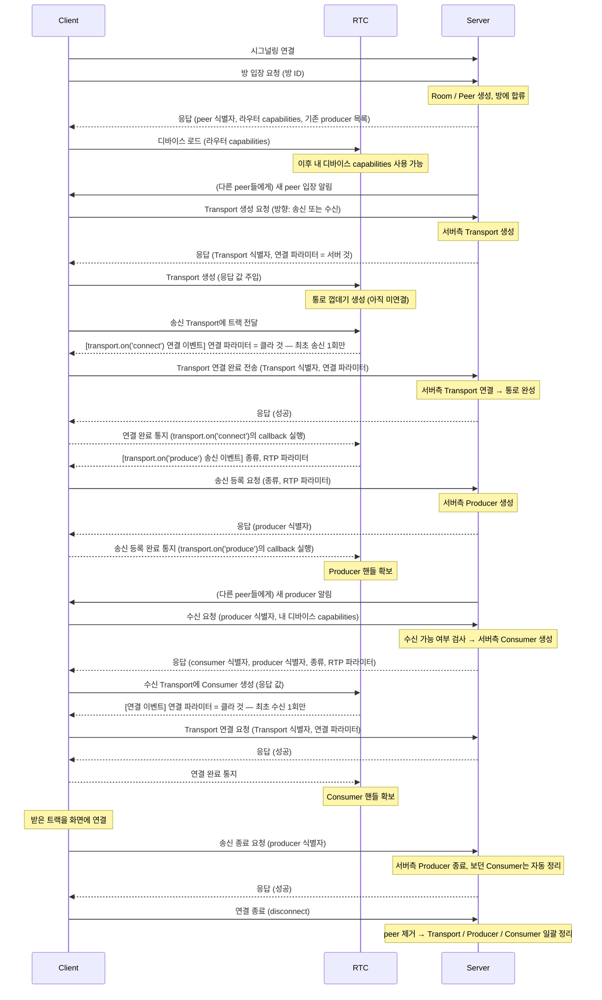

# Signaling Protocol — Handshake (구현 순서)

클라이언트가 방에 입장해서 양방향 미디어를 주고받기까지의 전체 핸드셰이크.

3개의 주체로 구분한다:

| 주체       | 정체                                                              | 역할                              |
| ---------- | ----------------------------------------------------------------- | --------------------------------- |
| **Client** | 앱 코드                                                           | 시그널링 메시지 송수신, 화면 렌더 |
| **RTC**    | WebRTC 클라이언트 라이브러리 (Device / Transport)                 | 미디어 협상, RTP 송수신           |
| **Server** | 시그널링 + 미디어 서버 (Router / Transport / Producer / Consumer) | 미디어 라우팅 허브                |

---

## 핵심 원칙

- **방 입장**만으로는 방(Router)에 소속될 뿐, 미디어 통로는 없다.
- 송신/수신하려면 **방향별 Transport**가 필요하다 — 송신용 1개 + 수신용 1개.
- **Transport 1개 위에 Producer/Consumer 여러 개**가 얹힌다 (video + audio여도 송신 Transport는 1개).
  - 관리 편의상 Producer만 하는 SendTransport와 Consumer만 하는 RecvTransport를 분리하여 2개의 Transport를 사용한다.
- 연결 정보(dtlsParameters)는 양쪽에 따로 있어 **교환**한다 — Transport 생성 응답은 _서버 것_(Client가 사용), 연결 요청은 _클라 것_(Server가 사용).
- Transport 연결은 그 Transport에서 **최초 송신 / 최초 수신 시 단 한 번**만 일어난다.

---

## 전체 시퀀스

---

## 보충

- **기존 producer 목록**(방 입장 응답): 이미 송출 중인 것들 `{ producer 식별자, peer 식별자, 종류 }`. 늦게 입장한 사람도 기존 송출자를 수신할 수 있게 해준다.
- **디바이스 capabilities는 받는 Client의 능력**이다 — producer 게 아니다. 기존 목록엔 없고, 수신 요청 때 클라가 자기 것을 실어 보낸다.
- **peer 식별자**는 "누구 영상인지"(타일/이름표/그룹핑)용 → 목록·알림에만 필요. 수신 요청엔 producer 식별자면 충분.
- video + audio를 둘 다 보내면 트랙 전달을 2번 → Producer 2개. **Transport는 1개 그대로.**
- (선택) 서버에서 Consumer를 멈춤 상태로 만들면, Client가 화면 연결 후 **재생 요청**을 보내야 RTP가 흐른다 — 첫 프레임 유실 방지.

---

## 구현 순서 요약

1. **방 입장** — Room/Peer 생성, 라우터 capabilities + 기존 producer 목록 반환, 디바이스 로드.
2. **Transport 생성** — 송신/수신 각각. 서버 연결 파라미터를 응답.
3. **Transport 연결** — 클라 연결 파라미터를 받아 서버측 연결 (최초 송/수신 때 1회).
4. **송신** — Producer 생성 + 다른 peer에게 새 producer 알림.
5. **수신** — 수신 가능 검사 후 Consumer 생성, RTP 파라미터 반환 → 클라가 화면 연결.
6. **정리** — 송신 종료, 연결 종료 시 peer 자원 일괄 정리.
