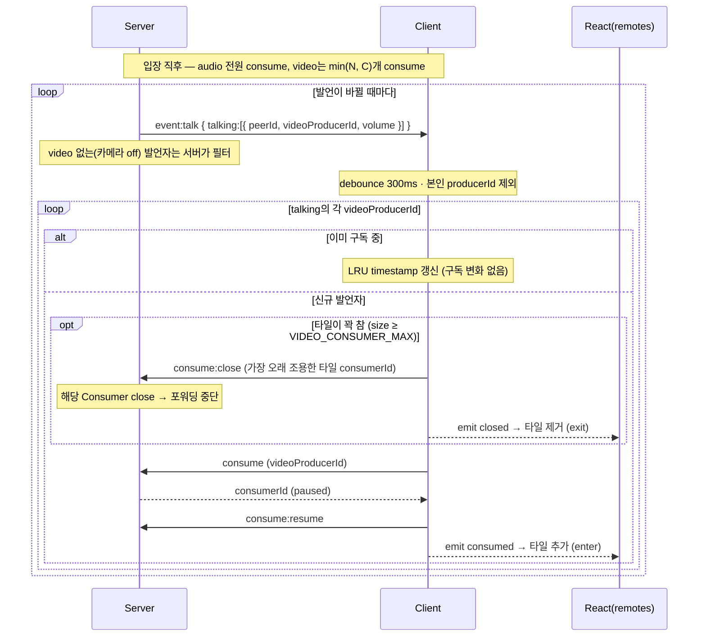

# Signaling Protocol — Active Speaker Switching

참가자가 많은 방에서 **모든 사람의 video를 consume할 수 없으므로**(전원이 전원을 받으면 O(N²)), "화면에 보이는 만큼"만 구독하고 **발언자에 따라 video 구독을 동적으로 교체**한다.

> 이 문서는 **현재 구현 기준**이다. 핵심 상수·심볼·파일 위치를 같이 적는다.

---

## 정책 (확정·구현됨)

- **audio는 항상 전원 구독, video만 타일 수 안에서 swap.**
  - audio도 발언자만 구독하는 안은 기각: 발언 시작 → 감지 → consume → resume 지연(수백 ms~1초) 때문에 **말 첫머리가 잘리고**, 짧은 맞장구는 영영 안 들린다. audio는 싸므로 깔아두는 비용이 작다.
  - `event:talk`은 **오로지 video 타일 교체 트리거**로만 쓴다. audio 구독은 swap 로직이 절대 건드리지 않는다.
- **detection은 서버, 정책은 클라이언트.** 서버는 "누가 말하나 + 그 발언자의 video producerId"까지 주석으로 내려주고(감지·신원), "어디에 넣고 누구를 뺄까"는 클라가 정한다.

---

## 핵심 상수 `VIDEO_CONSUMER_MAX`

`packages/shared/common.constants.ts` → **현재 `10`**. 한 군데서 다음을 전부 지배한다:

| 사용처 | 위치 | 의미 |
| --- | --- | --- |
| `AudioLevelObserver.maxEntries` | `mediasoup/src/business/room.module.ts` | 서버가 보고하는 **동시 발언자 상한** |
| video swap 상한 | client `subscribeEventTalk` | 동시에 구독하는 video 타일 수 |
| video consume 가드 | client `consumeWithinLimit` | 이 수를 넘으면 새 video consume 거부 |
| UI 타일 cap | `app/src/App.tsx` `remoteVideos.slice(0, VIDEO_CONSUMER_MAX)` | 그리드에 그리는 원격 video 수 |

> 즉 "동시 발언자 보고 수"와 "화면 타일 수"가 같은 상수를 공유한다. 한쪽만 늘리고 싶으면 상수를 분리해야 한다. (본인 타일은 로컬 렌더라 이 cap과 별개 — 화면엔 `본인 1 + 원격 최대 10`.)

---

## `event:talk` (서버 → 전체 브로드캐스트)

`packages/shared/signaling-events.types.ts`:

```ts
export type EventTalk = {
  talking: { peerId: string; videoProducerId: string; volume: number }[];
};
```

- 서버는 `AudioLevelObserver`의 `volumes`(audio producer 단위)를 받아, 각 발언자의 **video producerId로 매핑**해서 내려준다 — `room.module.ts`의 `getVideoProducerIdByAudioProducerId(audioProducerId)`.
- **video가 없는(카메라 off) 발언자는 서버가 필터링**해서 아예 목록에서 뺀다 (`!!videoProducerId`). 그래서 `videoProducerId`는 항상 유효한 string.
- `io.to(roomId).emit(...)`로 **방 전체에 같은 payload**를 뿌린다. `silence`(빈 발언)면 빈 `talking`이 온다.
- 관찰자 설정: `interval: 500ms`, `threshold: -55`, `maxEntries: VIDEO_CONSUMER_MAX`.

**본인 제외는 클라 책임.** 본인이 말하면 본인 entry도 브로드캐스트로 돌아온다. 클라는 자기 producer 집합으로 거른다(아래).

---

## 타일 채우기 / swap 규칙 (클라)

`C` = `VIDEO_CONSUMER_MAX`, `N` = video 켜진 원격 peer 수(본인 제외):

| 조건 | 동작 |
| --- | --- |
| **N ≤ C** | 입장 시 전원 video 구독, 이후 구독 변화 없음 (발언자는 하이라이트만 — 향후) |
| **N > C** | C개만 구독, 발언자 기준 swap. 빈 자리 없을 때만 **가장 오래 조용한 타일 1개 evict** |

swap 로직은 **빈 타일이 있으면 evict 없이 추가**만 한다. 꽉 찼을 때만 LRU 1자리 교체. 초기 구독은 `consumeWithinLimit`의 video 가드(`size >= C`)가 자동으로 `min(N, C)`개로 제한한다.

### 클라 구현 — `app/src/shared/lib/mediasoup.client.module.ts`

`subscribeEventTalk` (`debounce(async, 300ms)`):

1. `myProducerIds = new Set(this.producers.keys())` — **본인 video producerId는 내 producers 맵에 있으므로** `myProducerIds.has(videoProducerId)`로 걸러진다.
2. 각 발언자 video producerId에 대해:
   - **이미 구독 중**이면 → `consumedVideoProducerIds`의 timestamp만 갱신 (LRU touch).
   - **신규**면 → `size >= C`일 때 가장 오래된(timestamp 최소) 1개를 `closeConsume`로 제거 후, `consumeWithinLimit(videoProducerId, peerId, "video")`.

상태:
- `consumedVideoProducerIds: Map<producerId, { timestamp, producerId }>` — LRU 기준은 **마지막 발언 시각**.
- `consumedAudioProducerIds: Set<producerId>` — audio는 swap 대상 아님.

---

## consume 관련 시그널링 (C→S)

| 이벤트 | 상태 | 정체 |
| --- | --- | --- |
| `consume` _(기존)_ | 구현 | video/audio 구독 추가 — paused Consumer 생성 |
| `consume:resume` _(기존)_ | 구현 | 화면 연결 후 RTP 흐름 시작 |
| `consume:close` _(신규)_ | 구현 | 타일에서 빠진 video 구독 해제 — `SignalingEvent.ConsumeClose`. 서버측 Consumer close → 포워딩 중단 |

---

## 전체 시퀀스



> 빈 타일이 있으면 `consume:close` 없이 `consume`만 한다(추가). 꽉 찼을 때만 LRU 1자리 교체. `silence`(빈 `talking`)는 강제 교체 트리거가 아니다.

---

## UI 반영 흐름 (구현됨)

swap은 클라이언트 내부에서 일어나므로, React 상태(`remotes`)에 반영하려면 이벤트가 필요하다. **emit 패턴으로 초기 consume과 swap을 한 경로로 통일**했다.

- 클라이언트가 `consumed: [RemoteStream]` / `closed: [{ consumerId }]` emit
  - `consumeWithinLimit` 성공 → `consumed`
  - `closeConsume` → `closed`
- `AppContext`가 `onConsumed`/`onClosed` 구독 → `setRemotes`. **초기 입장·신규 producer·active-speaker swap 전부 이 두 구독으로 UI에 반영**된다.

### "슉" 애니메이션 — `app/src/App.tsx`, `VideoTile.tsx`

- `<AnimatePresence>` + `<motion.div layout>`, **`key={r.peerId}`** (swap마다 바뀌는 `consumerId`가 아니라 안정적인 peerId — 그래야 DOM 재활용 + layout 슬라이드/페이드가 자연스럽다).
- swap = `closed`(옛 타일 exit) + `consumed`(새 타일 enter) → 그리드가 부드럽게 재배치.
- **키프레임 갭 마스킹**: 새 video는 첫 키프레임 전까지 회색이다. `VideoTile`이 첫 프레임(`onPlaying`) 전엔 아바타 placeholder를 덮고, 프레임이 들어오면 video를 페이드 인한다.

---

## 미구현 / 향후

- **핀 보호** — eviction에서 핀 타일 제외. (본인은 자기 video를 consume하지 않으므로 이미 안전.)
- **하이라이트** — 발언자 테두리 강조(이미 타일 안인 경우)는 아직 없음. 현재는 구독 변화로만 반응.
- **`requestKeyFrame`** — swap 직후 키프레임 강제 요청은 안 함. 대신 UI placeholder+페이드로 회색 갭을 가린다.
- **audio "상위 N" 축소** — 현재 audio는 전원 구독. 수백~수천 명 규모에서만 필요(정책만 좁히면 됨, 구조 불변).
- **디바운스 → 비대칭 히스테리시스** — 현재 단순 `debounce(300)`. "X ms 지속 시 승격, Y ms 조용 시 강등"은 미적용.
- **범위 밖** — simulcast 레이어 전환(썸네일=저해상도/발언자=고해상도), 서버 주도 레이아웃, 화면공유·멀티캠(peer당 video 1개 가정).

> 핸드셰이크 전체 흐름은 [protocol.01.handshake.md](./protocol.01.handshake.md), 구현 현황은 [overview.md](./overview.md) 참고.
