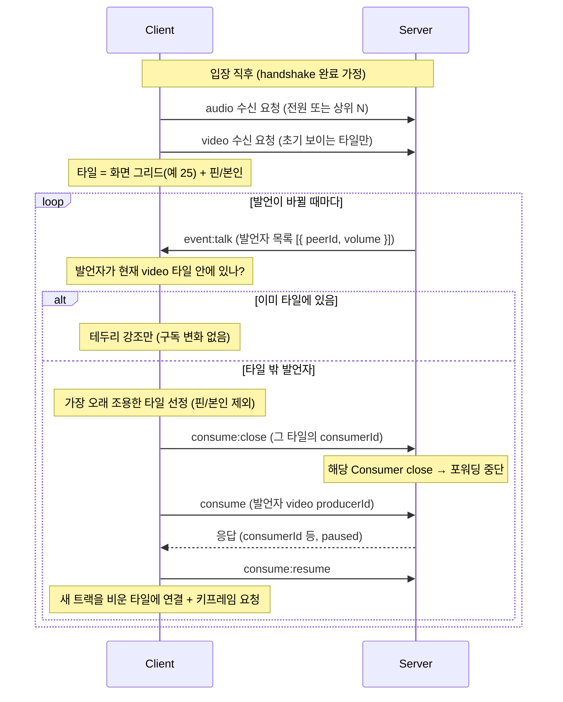

# Signaling Protocol — Active Speaker Switching

참가자가 수십~수백 명인 방에서 **모든 사람의 video를 consume할 수 없으므로**(전원이 전원을 받으면 O(N²)), "화면에 보이는 만큼"만 구독하고 **발언자에 따라 video 구독을 동적으로 교체**하는 흐름.

> 전제: 발언자 감지(`event:talk`)는 이미 구현됨 — 방마다 `AudioLevelObserver`가 발언자 목록 `{ peerId, volume }[]`을 방 전체(`io.to(roomId)`)에 브로드캐스트한다.

---

## 핵심 원칙

- **video는 화면 타일 수만큼만 consume**한다 (예: 그리드 최대 25). audio는 싸므로(~40kbps) 더 넓게(전원 또는 상위 N) 구독해 **화면 밖 발언자 목소리도 들리게** 한다.
- **detection은 서버, 정책은 클라이언트.**
  - "누가 말하나"는 구독 안 한 producer까지 봐야 하므로 **서버만** 안다 → `event:talk`.
  - "발언자를 화면 어디에 넣고 누구를 뺄까"는 뷰포트(그리드 크기·핀·페이지)가 **클라마다 다르므로** 클라가 정한다.
- 서버는 **감지(`event:talk`) + 실행(consume / 구독 해제)** 만 한다. 정책은 갖지 않는다.
- 발언자가 현재 video 구독 집합 **밖**이면 → 그 video를 **새로 consume**하고, **가장 오래 조용한 타일**을 구독 해제한다 (자리 1개 교체).
- `peerId → video producerId` 매핑은 클라가 이미 가진 정보로 해결한다 — `room:join`의 기존 producer 목록 + `event:producer:new`(둘 다 `{ producerId, peerId, kind }`). **새 서버 데이터 불필요.**

---

## 새 시그널링 이벤트

| 이벤트                       | 방향 | 정체                                                                  |
| ---------------------------- | ---- | --------------------------------------------------------------------- |
| `consume` _(기존 재사용)_    | C→S  | 발언자 video 구독 **추가** — `canConsume` 검사 후 paused Consumer 생성 |
| `consume:resume` _(기존)_    | C→S  | 화면 연결 후 RTP 흐름 시작                                            |
| **`consume:close`** _(신규)_ | C→S  | 타일에서 빠진 video 구독 **해제** — 서버측 Consumer를 close해 포워딩 중단 |

`consume:close`가 이 기능의 핵심 추가분이다. 현재는 producer/transport close로만 Consumer가 정리되어 **클라가 능동적으로 구독을 끊는 통로가 없다**. 구독을 안 끊으면 화면에서 뺀 video도 RTP가 계속 흘러 대역폭이 안 줄어든다.

---

## 전체 시퀀스

> 발언자가 빠르게 바뀌면 교체가 폭주하므로 **디바운스/히스테리시스**를 둔다 — "발언 X ms 지속 시 승격, Y ms 조용하면 강등". `event:talk`의 `silence`(빈 목록)는 "현재 발언자 없음"이라 강제 교체 트리거가 아니다.

---

## 보충

- **eviction 정책(클라)** — 뺄 타일은 **가장 오래 조용한(LRU) 타일**. **핀·본인 타일은 보호**해서 안 빠지게 한다.
- **keyframe** — 새로 consume(또는 resume)한 video는 **다음 키프레임이 와야** 화면에 뜬다. 교체 직후 `requestKeyFrame`을 보내지 않으면 새 발언자가 1~2초 회색으로 멈춘 듯 보인다.
- **audio / video 분리** — audio는 넓게 깔아 둬서 화면 밖 발언자도 들리고, 그 음량으로 video 승격을 판단한다. video만 타일 수로 상한.
- **prefetch(선택)** — 보이는 타일 경계 바로 밖 한 줄까지 미리 구독해두면 스크롤·교체 시 회색 타일이 덜 보인다.
- **close vs pause(선택)** — 빈번한 교체는 `pause/resume`(재협상 없음)이 가볍지만, 수백 명 규모에선 Consumer 객체 수를 묶기 위해 보이는 것만 `consume`/`consume:close`로 만들고 닫는 편이 메모리에 유리하다.

---

## 범위

- 이번 단계는 **클라 정책 + 서버 실행(`consume:close` 추가)** 까지.
- simulcast 레이어 전환(썸네일=저해상도, 발언자=고해상도), 서버 주도 레이아웃(웨비나형 일괄 push)은 **범위 밖**.

> 핸드셰이크 전체 흐름은 [protocol.01.handshake.md](./protocol.01.handshake.md), 구현 현황은 [overview.md](./overview.md) 참고.
